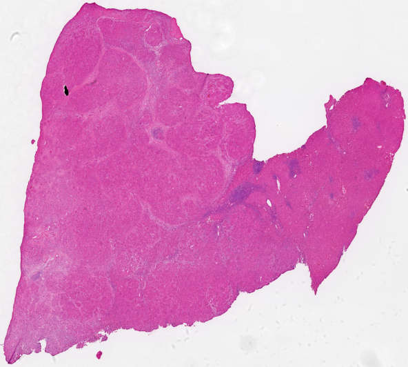
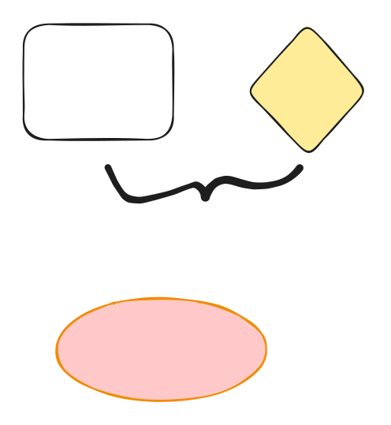

# Overview

StereoMap is a desktop application designed to provide the essential analysis functionality you need to explore your Stereo-seq data interactively.

## inline image



## Emoji

:tada:

## Link

[#link](./#link "mention")

$$f(x) = x * e^{2 pi i \xi x}$$

paragraph

* list1
* list2
* list3

1. ordered list1
2. ordered list2
3. ordered list3

* [x] todo1
* [ ] todo2
* [ ] todo3

***


This is Hint


> This is quote

```
// Some code
mkdir test
```


baidu.com


| Hd1  | Hd2  | Hd3  |
| ---- | ---- | ---- |
| col1 | col2 | col3 |
|      |      |      |
|      |      |      |

<table data-view="cards"><thead><tr><th></th><th></th><th></th></tr></thead><tbody><tr><td></td><td></td><td>card1</td></tr><tr><td></td><td></td><td>card2</td></tr><tr><td>card3</td><td></td><td></td></tr></tbody></table>



This first Tab



This second tab2



<details>

<summary>Expandable</summary>


</details>



$$
f(x) = x * e^{2 pi i \xi x}
$$








[page-1.md](page-1.md)


